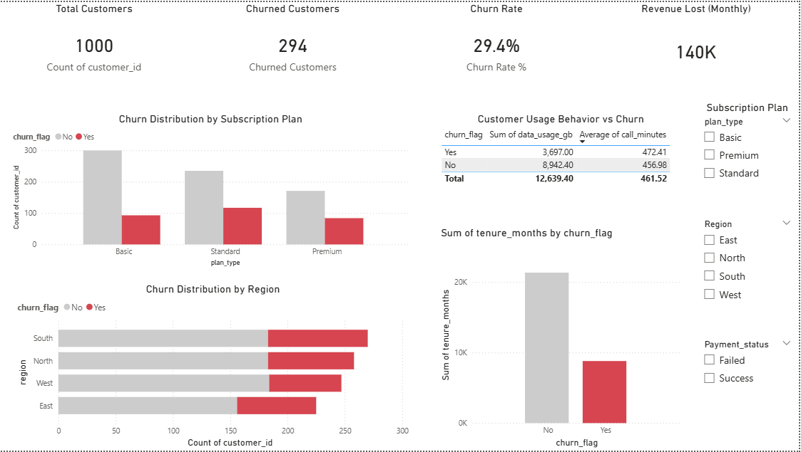

# Customer Churn Analysis

## About the Project
This project focuses on analyzing customer churn and understanding how it impacts
revenue. The complete analysis is done using SQL, Python, and Power BI.  
The main objective is to identify churn patterns, customer behavior, and business areas
that need attention to reduce customer loss.

## Tools Used
- SQL – for data cleaning, joins, and aggregations
- Python – for data analysis and exploration
- Power BI – for building an interactive dashboard

## Dataset Details
The dataset contains customer information, subscription plans, usage data,
payment status, and churn flags. Multiple CSV files were combined and cleaned
before analysis.

## Project Process
1. Collected data from different CSV files  
2. Cleaned and merged data using SQL  
3. Performed exploratory data analysis in Python  
4. Built an interactive Power BI dashboard  
5. Derived business insights from the results  

## Dashboard
Power BI dashboard shows:
- Total customers and churn rate
- Revenue loss due to churn
- Churn by subscription plan and region
- Customer usage behavior comparison

Dashboard screenshots are available in the `screenshots` folder.
## Dashboard Preview

## Key Insights
- Customers on Basic plans show higher churn compared to Premium plans
- Failed payments are strongly linked to churn
- Certain regions have consistently higher churn rates
- Higher usage customers tend to churn less

